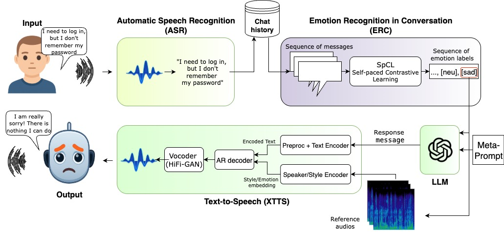

<table width="100%" border="0" align="center">
    <tr>
        <td align="center" width="50%">
        
        </td>
        <td align="center" width="50%">
         
        </td>
    </tr>
</table>

<a href="https://www.inf.uni-hamburg.de/en/inst/ab/wtm.html" target="_blank">Knowledge Technology Group (WTM)</a>
##### Department of Informatics, University of Hamburg
 

#### Paper submitted to ICASSP 2026
## TEXT-TO-SPEECH BASED EMOTION-AWARE HUMAN-ROBOT DIALOGUE SYSTEM
 
<table>
    <tr align="center">
        <td>
            <a href="https://github.com/al1ve1t" target="_blank">Elnur Alimirzayev</a>
            <a href="https://www.inf.uni-hamburg.de/en/inst/ab/wtm/people/kaplan.html" target="_blank">Burak Can Kaplan</a>
            <a href="https://www.inf.uni-hamburg.de/en/inst/ab/wtm/people/weber.html" target="_blank">Cornelius Weber</a>
            <a href="https://www.inf.uni-hamburg.de/en/inst/ab/wtm/people/wermter.html" target="_blank">Stefan Wermter</a>
        </td>
    </tr>
</table>

### Abstract
The rapid progress of large language models (LLMs) has
accelerated the rise of interactive AI systems, yet most remain
text-only and largely emotion-agnostic. Adding text-tospeech
(TTS) enables voice interaction, but current state-ofthe-
art TTS models mostly offer indirect, coarse control over
prosody and frequently fail to realize requested emotions.
This mismatch between intended content and delivered tone
undermines user trust in high-stakes settings such as customer
support and healthcare. Two technical obstacles cause this
gap: 1) content and prosody are tightly entangled, so an inappropriate
emotion can degrade intelligibility, and 2) models
tend to express the emotions that are standard for the given
text. Addressing these issues is essential for emotionally coherent
and controllable speech in LLM-driven interactions.
Our approach proposes a modular human-robot interaction
system that integrates an emotion recognition in conversations
model with TTS to enable emotional awareness. Due to
this integration, our TTS can decide on the correct emotion to
answer, select appropriate reference audio to adapt its prosody
in each interaction, and generate speech of an ”emotionally
intelligent” robot. Additionally, we set a new baseline for an
emotional dialogue system pipeline and automated evaluation
of such systems.

### Architecture

### Dialogue Demos:

Link to the Demo: https://eahris.com/

Anger

Happiness

Sadness
